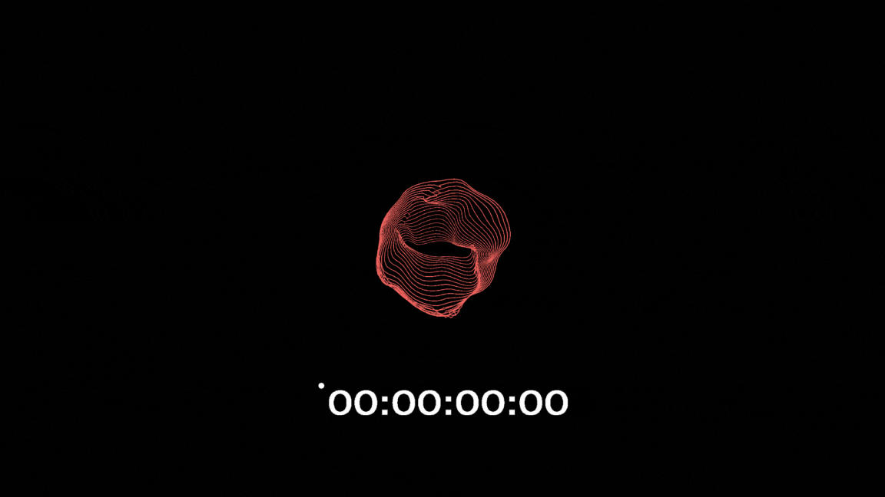

# Opentags

Opentags is an open-source alternative to Apple's AirTags, providing a customizable and privacy-focused solution for tracking and locating your belongings using Ultra-Wideband (UWB) technology.

## Features

- Open-source design, allowing for customization and transparency
- Ultra-Wideband (UWB) technology for precise tracking
- Secure encryption to protect user privacy
- Compatible with a wide range of devices
- Easy-to-use mobile app for tracking and managing tags (iOS support available, Android support in development)

## Getting Started

### Prerequisites

You can either order your own [Opentags hardware here](https://buy.stripe.com/8wM6oCcYg4fP6ly144)  or build your own using the provided schematics and firmware. 

To get started, you will need the following:
- Opentags hardware
- USB-C cable for flashing firmware
- Computer to flash firmware
- iOS device to use the Opentags app

### Hardware

We provide extensive documentation on our hardware [here](https://open-tags.github.io/docs/hardware/). 

### Firmware

For detailed documentation and guides, please refer to our [documentation](https://open-tags.github.io/docs/firmware/).

### iOS App

For detailed documentation and guides, please refer to our [documentation](https://open-tags.github.io/docs/ios/).

## Contributing

We welcome contributions from the community! If you'd like to contribute to Opentags, please follow these steps:

1. Fork the repository
2. Create a new branch for your feature or bug fix
3. Make your changes and commit them with descriptive messages
4. Push your changes to your forked repository
5. Submit a pull request to the main repository

Please ensure that your code follows our coding conventions and includes appropriate tests.

We are actively seeking support for the development of an Android app. If you have expertise in this area and would like to contribute, please reach out to us on our Discord server.

## License

Opentags is released under the MIT License. This means that you are free to use, modify, and distribute the project, both commercially and non-commercially, as long as you include the original copyright notice and permission notice in any copies or substantial portions of the software.

## Contact

If you have any questions, suggestions, or issues, please join our : [Discord server](https://discord.com/invite/HYT2UBpeHM)

We appreciate your interest in Opentags and look forward to your contributions!