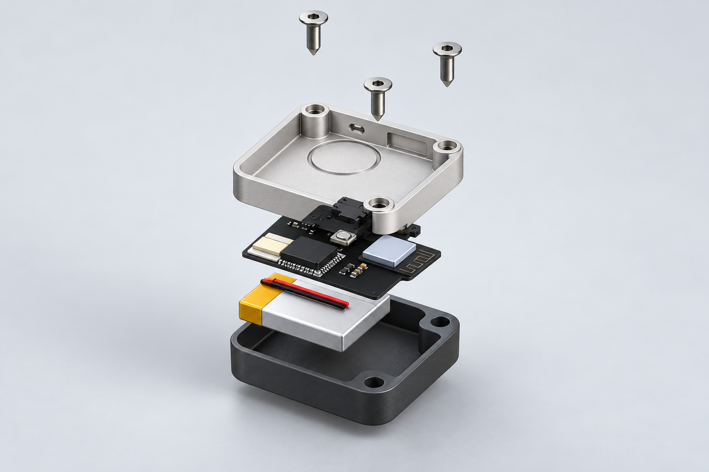

# opentag · early UWB prototype

Hardware, firmware, and an iOS app from the early opentags research project.

> **Historical R&D reference.** This prototype predates opentag U1 and uses different hardware and firmware. For current products and setup guides, visit [opentags](https://open-tags.com/) and the [documentation](https://open-tags.com/docs/).

[Hardware](Hardware/) · [Firmware](Firmware/README.md) · [iOS app](iOS/OpenTags/README.md) · [Current ROS 2 source](https://github.com/open-tags/open-tags.github.io/tree/main/ros2)

  
   
  Early prototype · AI-assisted illustration based on the original CAD view

## Explore the prototype

The project explored ultra-wideband (UWB) ranging and iPhone interaction. These files preserve that development work; they are not a complete, validated product release.

| Resource | What is included | Start here |
| --- | --- | --- |
| Hardware | KiCad schematics and board layouts, component libraries, BOMs, and fabrication exports | [KiCad project](Hardware/Hardware.kicad_pro) |
| Firmware | Arduino / PlatformIO experiments and bundled radio libraries | [Build notes and missing dependencies](Firmware/README.md) |
| iOS | Xcode project based on Apple's Nearby Interaction accessory sample | [iOS setup notes](iOS/OpenTags/README.md) |

## Before building

- **Firmware dependencies are incomplete.** The active PlatformIO target is `xiaoble_adafruit_nrf52`. The source includes `niq.h` and the configuration references NIQ libraries that are not included in this repository. A clean checkout is not ready to build; see the [firmware notes](Firmware/README.md).
- **The iOS app is experimental.** Its setup notes require an iPhone with Apple's U1 chip and a compatible accessory. Apple's U1 chip is unrelated to the opentag U1 product name.
- **Hardware files record prototype revisions.** Check the schematic, board revision, and firmware pin assignments together before fabrication or flashing.

## Current opentags resources

opentags now builds tracking hardware and integration tools for robotics. Start with the [website](https://open-tags.com/) for current products, the [documentation](https://open-tags.com/docs/) for setup, or the [ROS 2 source](https://github.com/open-tags/open-tags.github.io/tree/main/ros2) for robot integration.

This repository's prototype files and license do not describe the hardware, firmware, or licensing of current products.

## Questions and corrections

Use [Issues](https://github.com/open-tags/opentag/issues) for questions or corrections about this prototype. Include the board revision, toolchain, and relevant logs when reporting a build problem. For current product inquiries, contact [hello@open-tags.com](mailto:hello@open-tags.com).

## License

See the repository's [MIT license](LICENSE). Bundled third-party components retain their own license notices, including the [iOS sample](iOS/OpenTags/LICENSE/LICENSE.txt) and [Adafruit nRFCrypto](Firmware/lib/Adafruit_nRFCrypto/LICENSE).
